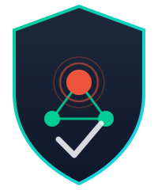

<p align="center">
  
</p>

# Network Analysis Intrusion System (NIDS)


🚀 **v5.0.0 — Codename: Bulwark**

A Streamlit dashboard that detects network intrusions in real time, comparing
a **Random Forest**, a **Decision Tree**, and an **Isolation Forest**
classifier trained on the NSL-KDD dataset — side by side, on the same traffic.

## Features

- 📡 **Live capture** — sniffs live traffic (scapy) and classifies it with a real
  trailing 2-second/100-connection windowed feature computation (not a static snapshot).
- 📂 **Pcap upload** — drop a Wireshark `.pcap`/`.pcapng` file and get an instant report.
- 🌲🌳🧭 **Three-model comparison** — Random Forest, Decision Tree, and (optionally)
  Isolation Forest anomaly detection, side by side on the same input.
- 📊 **Visual analytics** — threat distribution, packet-size box plots, volume-vs-size scatter plots.
- 🤖 **Rule-based summary** — flags likely attacker/victim IPs when threat levels spike.
- 🔔 **Alerting** — critical-threat notifications via Slack webhook, generic webhook, or email (opt-in via `.env`).
- 📜 **Persistent history** — every detection is saved to SQLite (`data/history.db`), beyond the 100-row live view,
  with a source filter, an attacks-over-time trend chart, full CSV/Excel export, and per-IP drill-down.
- ⚙️ **Configurable thresholds** — adjust the CRITICAL/SUSPICIOUS cutoff live via a sidebar slider.
- 🧠 **Explainable AI tab** — feature-importance charts for RF/DT.

## Screenshots

Sample NSL-KDD traffic previews live in [`assets/images/`](assets/images/).

## Dataset

Trained on **NSL-KDD**. Source, citation, file layout, and column meanings
are documented in [docs/DATASET.md](docs/DATASET.md).

## Architecture

```
data/nsl-kdd/  --(train)-->  scripts/train_models.py --> models/*.pkl
                                                              │
data/pcaps/ or live traffic --> src/nids/features.py --------┤
                                                              ▼
                                              src/nids/app.py (Streamlit UI)
```

See [docs/architecture/architecture.md](docs/architecture/architecture.md) for details.

## Technology stack

Python 3.11+, Streamlit, scikit-learn, scapy, pandas, Altair.

## Requirements

- Python 3.11+
- On Linux/macOS, live capture (Tab 1) needs raw-socket privileges (root or `CAP_NET_RAW`).
- Pcap upload (Tab 2) has no special privileges.

## Installation

```bash
git clone <repo-url>
cd "Network Analysis Intrusion System"
python -m venv .venv && source .venv/bin/activate   # Windows: .venv\Scripts\activate
pip install -r requirements.txt
```

## Quick start

```bash
streamlit run src/nids/app.py
```

Open the URL Streamlit prints (default `http://localhost:8501`).

## Configuration

Copy `.env.example` to `.env` and adjust as needed. The feature schema used
by both models is documented in [`config/features.yaml`](config/features.yaml).

## Running locally

See [docs/guides/running-locally.md](docs/guides/running-locally.md).

## Docker

```bash
docker compose up --build
```

## Project structure

```
├── .github/          CI workflows, issue/PR templates
├── assets/images/    dataset preview images
├── config/            feature schema reference
├── data/
│   ├── nsl-kdd/       NSL-KDD train/test sets
│   ├── pcaps/         sample .pcap files for manual testing
│   └── history.db     persisted detection history (SQLite, gitignored)
├── docs/              architecture, guides, releases, troubleshooting
├── models/            trained rf_model.pkl / dt_model.pkl / iforest_model.pkl
├── notebooks/         original training notebook
├── scripts/           train_models.py (CLI retraining)
├── src/nids/          app.py (UI), features.py, storage.py, alerts.py, anomaly.py (pure logic)
└── tests/             pytest suite
```

## Testing

```bash
pytest -q
```

## Security

See [SECURITY.md](SECURITY.md).

## Contributing

See [CONTRIBUTING.md](CONTRIBUTING.md).

## Roadmap

See [ROADMAP.md](ROADMAP.md).

## Troubleshooting

See [docs/troubleshooting/troubleshooting.md](docs/troubleshooting/troubleshooting.md).

## License

[MIT](LICENSE)

## Support

See [SUPPORT.md](SUPPORT.md).
