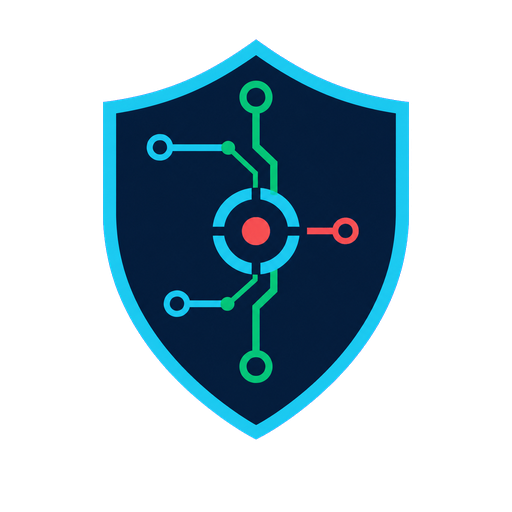

<div align="center">



# Smart Network Intrusion Detection System

### A multi-model network intrusion detection, triage, and response workspace

[](docs/guides/running-locally.md)
[](docs/releases/v11.0.0.md)
[](docs/releases/v11.0.0.md)
[](LICENSE)
[](src/nids/app.py)
[](scripts/train_models.py)
[](docs/guides/running-locally.md)
[](tests/)
[](CONTRIBUTING.md)

Inspect live traffic or drop in a Wireshark capture, compare three model verdicts,
and turn model disagreement into an explainable operator queue — with alerting,
persistent history, evidence exports, and a read-only REST API.

[**Desktop .exe**](docs/deployment/desktop-exe.md) · [**Changelog**](CHANGELOG.md) · [**Roadmap**](ROADMAP.md) · [**Report a Bug**](.github/ISSUE_TEMPLATE/bug_report.md)

</div>

---

**Authors:** [Mohammad Sufiyan Aasim](https://github.com/SufiyanAasim) (`sufiyanaasim@outlook.com`) · [Muhammad Taha Siddiqui](https://github.com/13eeCoder) (`tahasiddiqui2100@gmail.com`)<br>
**Latest release:** v11.0.0 — **Cipher** _(Autonomy)_

**Docs:** [Architecture](docs/architecture/architecture.md) · [API](docs/api/api.md) · [Local setup](docs/guides/running-locally.md) · [User guide](docs/guides/user-guide.md) · [Docker & Render](docs/deployment/docker.md) · [Desktop build](docs/deployment/desktop-exe.md) · [Troubleshooting](docs/troubleshooting/troubleshooting.md) · [Release notes](docs/releases/)<br>
**Community:** [Contributing](CONTRIBUTING.md) · [Security](SECURITY.md) · [Support](SUPPORT.md) · [Roadmap](ROADMAP.md) · [Release process](RELEASE.md) · [Code of Conduct](CODE_OF_CONDUCT.md)

Smart Network Intrusion Detection System (S-NIDS) is a Python security workspace that
runs Random Forest, Decision Tree, and Isolation Forest over the same packet
evidence. It reconstructs the 41-feature NSL-KDD schema, preserves each raw
model verdict, then adds deterministic consensus triage so an analyst can see
what needs attention first without losing the evidence behind the score.

**v11.0.0 adds policy-governed autonomous defense:** correlate high-confidence
evidence into incidents, validate decisions in Shadow mode, approve reversible
responses, monitor behavior drift, and permit bounded automatic containment only
when an Administrator and server policy explicitly enable it.

> [!IMPORTANT]
> This is a research and portfolio system built around the NSL-KDD benchmark.
> Use its verdicts as decision support—not as a substitute for a production IDS,
> packet-forensic review, or a current threat-intelligence platform.

## ✨ Features

### 🧠 Three-Model Comparison
- **Random Forest** — supervised ensemble trained on labelled NSL-KDD attacks (77.1% test accuracy)
- **Decision Tree** — a single interpretable tree, same feature set (78.9%)
- **Isolation Forest** — *unsupervised*, trained only on normal traffic so it flags outliers the supervised pair never learned (80.0%)
- All three classify the **same packets simultaneously** — their disagreements are the interesting part

### 📡 Live Capture
- Real-time scapy sniffing with a **true trailing 2-second / 100-connection window** for `count`, `srv_count` and the `*_rate` features — not a per-packet snapshot
- Live packets/sec + KB/sec throughput chart over a rolling 60-second window
- Capture-readiness detection: warns about a missing **Npcap** driver on Windows instead of silently capturing nothing
- Explicit **capture-interface selector** for Ethernet, Wi-Fi, VPN, and virtual adapters
- In-app capture-scope guidance: local adapters see this device's visible traffic; whole-LAN monitoring requires SPAN/port mirroring, a TAP, or a gateway sensor
- Calmer 2.5-second dashboard refresh cadence; Stop only pauses intake and never prepares or downloads a report
- Live CSV and PDF controls appear only after **Prepare Report Exports**; Print stays in the Live Capture header

### 📂 Pcap Upload
- Drop a `.pcap`/`.pcapng` from Wireshark and get an instant classified report
- Three sample captures bundled in `data/pcaps/` (DDoS, Neptune, mixed)

### 📊 Visual Analytics
- Threat distribution, packet-size box plots, and an interactive log-log volume-vs-size scatter — per model
- **Explainable AI** tab: top-10 feature importances for RF/DT (and why Isolation Forest has none)

### 🔔 Alerting
- **Slack**, generic **webhook**, **email** (SMTP), **PagerDuty** (Events API v2) and **Microsoft Teams**
- Opt-in in-browser **beep** (synthesized at runtime — no audio asset) and **desktop notification**
- Notification preferences live beside Deploy so alert controls stay available without extending the sidebar
- Cooldown-throttled per model so a sustained attack can't spam every rerun

### 📜 Persistent History & Analytics
- Every detection persisted to SQLite, far beyond the 100-row live view
- Attacks-over-time trend chart, source filter, and **per-IP drill-down** across sessions
- **Source-IP geography** breakdown (private/public/loopback/reserved) with an optional MaxMind world map
- Six equal-size summary cards keep totals, model flags, consensus, and average risk directly comparable

### 🎯 Consensus Threat Triage
- Every row gets a deterministic **0–100 consensus risk score** from the models available for that run
- Clear / Guarded / Elevated / Critical queues prioritize evidence without hiding the raw model verdicts
- Triage persists to SQLite and is queryable from the dashboard and REST API

### Policy-Governed Autonomous Defense
- **Shadow**, **Approval**, and **Autonomous** modes separate observation, human authorization, and bounded response
- Correlates repeated high-risk evidence by source and time window into stable incidents
- Private sources are protected by default; active blocks are rate-limited, time-bound, audited, and reversible
- Host execution is disabled by default and requires the independent `NIDS_AUTONOMY_EXECUTE=true` server gate
- Adaptive behavior drift recommends reviewed offline retraining without silently replacing production models

### 📤 Export
- **CSV**, **Excel**, formatted **PDF** report, and a **Fernet-encrypted backup** of the history database

### 🔒 Access Control & Response
- Optional **PBKDF2-SHA256 login** (off by default) with multi-user **admin/viewer roles**
- Separate **Sign in** and optional **Create account** screens; clickable Administrator/Viewer selectors open the matching credential form
- Self-service accounts are always Viewer-only and stored as salted hashes
- The compact one-screen sidebar is the single source for the active access level; Live Capture stays focused on capture actions, the Credits hero stays presentation-only, and **Role permissions** opens the complete role matrix
- Administrators can export full history and encrypted DB backups; viewers retain monitoring, PCAP analysis, recent history, and triage access
- **Block suggestions** remain copy-paste-only; v11 autonomous execution is isolated behind explicit policy, TTL, rollback, and audit safeguards

### Professional Interface
- Clean Material icons replace decorative emoji controls in the application UI
- Primary tabs are **Dashboard**, **Live Capture**, **Upload PCAP**, **Model Logic**, **Autonomy**, **History**, and **Credits**
- Dashboard opens first with aggregate triage, model-rate, risk, and source analytics; Live Capture owns Print, Record Screen, capture controls, throughput monitoring, and detailed model-result graphs
- Credits contains contributor profiles and GitHub links; **About this project** opens the project summary and technology list
- Light and dark themes share the same spacing, contrast, card geometry, and responsive hierarchy
- Verdicts use stable `Normal` and `Attack` labels; older decorated history values are normalized automatically

### 🔌 REST API
- Dependency-free read-only JSON API over the history DB, with optional bearer-token auth
- Dedicated `/api/triage` endpoint with `min_risk`, `source`, and bounded `limit` filters
- Read-only autonomy summary, incident, and action endpoints

### API surface

| Endpoint | Purpose | Useful filters |
|---|---|---|
| `GET /health` | Service and v11 version health check | — |
| `GET /api/summary` | Detection totals, model attack counts, average risk, critical count | — |
| `GET /api/autonomy/summary` | Correlated incident and action totals | — |
| `GET /api/autonomy/incidents` | Latest correlated autonomy incidents | `limit` |
| `GET /api/autonomy/actions` | Audited response action state | `status`, `limit` |
| `GET /api/detections` | Newest persisted detections | `source`, `limit` |
| `GET /api/triage` | Highest-risk operator queue | `min_risk`, `source`, `limit` |
| `GET /api/ip/<ip>` | One source IP's evidence, counts, risk, and first/last seen | URL-encoded IP |

Set `NIDS_API_TOKEN` to protect every route with a bearer token. The API is
strictly read-only, returns JSON with `Cache-Control: no-store`, and caps query
sizes. See the complete [API reference](docs/api/api.md).

---

## 🏗️ Architecture

```
   data/nsl-kdd/  ──(train)──►  scripts/train_models.py  ──►  models/*.pkl
                                                                  │
   Live packets (scapy sniff)                                     │
   or .pcap upload (rdpcap)                                       │
            │                                                     │
            ▼                                                     ▼
   ┌──────────────────────┐        ┌──────────────────────────────────────┐
   │  features.py         │        │  RF  ·  DT  ·  Isolation Forest      │
   │  packets_to_df()     │───────►│  (+ anomaly.py verdict mapping)      │
   │  2s/100-conn window  │        └──────────────┬───────────────────────┘
   └──────────────────────┘                       │
                                                  ▼
                                      triage.py (consensus risk)
                                                  │
                                                  ▼
            ┌─────────────────────────────────────────────────────────┐
            │                app.py  (Streamlit UI)                    │
            │  Live Capture · Upload · Explainable AI · History        │
            └──┬───────────┬────────────┬───────────┬─────────────────┘
               ▼           ▼            ▼           ▼
         storage.py    alerts.py    geo.py    reporting.py
         (SQLite)      (5 channels) (GeoIP)   (PDF)
               │           │
               ▼           ▼
          api.py      notify.py · firewall.py · auth.py · crypto.py
        (REST/JSON)   (sound)     (blocks)     (login)   (backup)
```

Full breakdown in [docs/architecture/architecture.md](docs/architecture/architecture.md).

---

## 🛠️ Technology Stack

| Layer | Technology |
|-------|-----------|
| Language | Python 3.11+ |
| UI Framework | Streamlit |
| Charts | Altair (Vega-Lite) |
| Packet Capture | scapy (Npcap on Windows, raw sockets on Linux/macOS) |
| Machine Learning | scikit-learn — RandomForest, DecisionTree, IsolationForest |
| Dataset | NSL-KDD (41 features) |
| Persistence | SQLite (stdlib `sqlite3`) |
| Reporting | reportlab (PDF) · openpyxl (Excel) |
| Crypto | `cryptography` (Fernet) · PBKDF2-SHA256 via `hashlib` |
| GeoIP | `geoip2` + MaxMind GeoLite2 (optional) |
| REST API | stdlib `http.server` — no framework |
| Desktop build | PyInstaller (folder build + launcher) |
| Tests | pytest (117) · ruff |

### Dependencies

| Package | Purpose |
|---------|---------|
| `streamlit`, `altair` | Dashboard and charts |
| `scikit-learn`, `joblib`, `pandas`, `numpy` | Models and data handling |
| `scapy` | Live capture and pcap parsing |
| `reportlab`, `openpyxl` | PDF and Excel export |
| `cryptography` | Encrypted history backup |
| `geoip2` | Optional GeoIP world map |

---

## 🚀 Getting Started

### Requirements
- Python 3.11 or higher
- **Windows only:** [Npcap](https://npcap.com/#download) for live capture (pcap upload works without it)
- Live capture needs Npcap with interface access (Windows) or root / `CAP_NET_RAW` (Linux/macOS); Windows Administrator is only needed for access-restricted Npcap installs

### Quick launch (desktop app)
Double-click **`NIDS.exe`** from a built `dist/NIDS/` folder — no Python required.
Build it with `python scripts/build_exe.py`, or see [docs/deployment/desktop-exe.md](docs/deployment/desktop-exe.md).

### Clone and run from source

```bash
git clone https://github.com/SufiyanAasim/smart-network-intrusion-detection-system.git
cd smart-network-intrusion-detection-system
python -m venv .venv && source .venv/bin/activate   # Windows: .venv\Scripts\activate
pip install -r requirements.txt
```

```bash
streamlit run src/nids/app.py
```

Open the URL Streamlit prints (default `http://localhost:8501`).

### Other entry points

```bash
python scripts/train_models.py    # retrain all three models
python src/nids/api.py            # REST API on 127.0.0.1:8600
python scripts/build_exe.py       # build dist/NIDS/NIDS.exe
make test && make lint            # pytest + ruff
```

Full setup details in [docs/guides/running-locally.md](docs/guides/running-locally.md).

### Docker launch

```bash
docker compose up --build                         # dashboard
docker compose --profile api up --build           # dashboard + REST API
docker compose --profile capture up nids-capture  # Linux host capture
```

The default container is intentionally unprivileged and supports PCAP upload,
history, exports, and triage. Raw capture is opt-in because it needs host
networking and Linux packet capabilities. Windows Npcap is for the native app,
not a Linux container. See the [container deployment guide](docs/deployment/docker.md).

---

## ⚙️ Configuration

All settings are optional — the app runs with none of them. Copy `.env.example` to `.env` and adjust.

| Variable | Default | Description |
|----------|---------|-------------|
| `CRITICAL_THRESHOLD_PCT` | `20` | % of traffic flagged before status escalates to CRITICAL |
| `ALERT_COOLDOWN_SECONDS` | `60` | Minimum seconds between two alerts for the same model |
| `MAX_PCAP_UPLOAD_MB` | `50` | Reject captures above this in-app safety limit |
| `NIDS_CAPTURE_INTERFACE` | auto | Default adapter identifier/label for live capture |
| `LIVE_REFRESH_SECONDS` | `2.5` | Minimum seconds between visible live-dashboard refreshes |
| `NIDS_DB_PATH` | `data/history.db` | Detection-history database location |
| `SLACK_WEBHOOK_URL` | — | Slack incoming-webhook URL |
| `ALERT_WEBHOOK_URL` | — | Generic JSON webhook |
| `ALERT_SMTP_HOST` / `ALERT_EMAIL_TO` | — | Email alerting (see `.env.example`) |
| `PAGERDUTY_ROUTING_KEY` | — | PagerDuty Events API v2 key |
| `TEAMS_WEBHOOK_URL` | — | Microsoft Teams incoming webhook |
| `NIDS_AUTH_PASSWORD_HASH` | — | Enables the login gate (`python src/nids/auth.py` to generate) |
| `NIDS_AUTH_USERS` | — | JSON list of users with `admin`/`viewer` roles |
| `NIDS_SIGNUP_ENABLED` | `false` | Enables Viewer-only self-registration (recommended for trusted local use only) |
| `NIDS_AUTH_DB_PATH` | `data/auth.db` | Hashed local self-registration account store |
| `NIDS_API_TOKEN` | — | Bearer token for the REST API |
| `NIDS_DB_ENCRYPTION_KEY` | — | Fernet key enabling the encrypted backup |
| `GEOIP_DB_PATH` | — | MaxMind GeoLite2-City `.mmdb` for the world map |

Local source runs automatically load the repository-root `.env` file through
`python-dotenv`. Values explicitly supplied by the shell, Docker, or Render
take precedence. The `.env` file is excluded from Git and Docker build context.

---

## ☁️ Deployment

| Target | Command / entry point | Live capture | Persistence |
|---|---|---|---|
| Local source | `streamlit run src/nids/app.py` | Yes, with OS privileges and capture backend | Local SQLite |
| Windows desktop | `python scripts/build_exe.py` → `dist/NIDS/NIDS.exe` | Yes, with Npcap; admin only when access-restricted | `%LOCALAPPDATA%/NIDS/history.db` |
| Docker | `docker compose up --build` | Upload-only by default | Version-neutral `nids-history` volume |
| Docker + API | `docker compose --profile api up --build` | Upload-only by default | Shared named volume |
| Docker capture profile | `docker compose --profile capture up nids-capture` | Linux host networking + `NET_RAW`/`NET_ADMIN` | Named volume |
| Render | Blueprint from `render.yaml` | Upload-only by design | Persistent `/data` disk |

Render requires `NIDS_AUTH_PASSWORD_HASH` and fails closed when authentication
is missing or invalid. The blueprint uses the paid Starter plan because Render
persistent disks are unavailable to Free web services. The container runs as a
non-root user, exposes a health check, honors Render's `$PORT`, and copies only
runtime assets into the image. See [Docker and Render deployment](docs/deployment/docker.md),
[desktop deployment](docs/deployment/desktop-exe.md), and
[local operation](docs/guides/running-locally.md).

---

## 🗂️ Project Structure

```
smart-network-intrusion-detection-system/
├── .github/                # Issue/PR templates, CI (lint · test · container · retrain)
├── assets/images/          # Canonical logo.png (app/docs) · generated logo.ico (exe)
├── config/                 # Feature schema reference
├── data/
│   ├── nsl-kdd/            # NSL-KDD train/test sets
│   ├── pcaps/              # Sample captures for manual testing
│   └── history.db          # Detection history (runtime, gitignored)
├── docs/
│   ├── api/                # REST API reference
│   ├── architecture/       # System architecture
│   ├── deployment/         # Docker, Render, and desktop deployment guides
│   ├── guides/             # User and local-run guides
│   ├── images/             # Figures used by the docs (NSL-KDD charts)
│   ├── releases/           # Per-version release notes (v1–v10)
│   └── troubleshooting/    # Common issues and fixes
├── models/                 # Trained rf/dt/iforest .pkl models
├── notebooks/              # Original coursework artefacts (historical — not live code)
│   ├── TheCode.ipynb           # The original notebook, as written
│   └── TheCode.py              # Same notebook flattened to a script
├── scripts/
│   ├── train_models.py         # CLI retraining
│   ├── desktop_launcher.py     # Frozen .exe entry point
│   └── build_exe.py            # PyInstaller build wrapper
├── src/nids/               # Application package  (○ @SufiyanAasim · ● @13eeCoder)
│   ├── app.py                  # ○ Streamlit UI · tabs · sidebar · charts
│   ├── features.py             # ● Packets → 41 NSL-KDD features (2s/100-conn window)
│   ├── netcheck.py             # ● Capture readiness · Npcap/libpcap detection
│   ├── throughput.py           # ● Per-second packets/sec · KB/sec aggregation
│   ├── geo.py                  # ● IP classification (RFC1918/public) + GeoIP
│   ├── auth.py                 # ● PBKDF2-SHA256 login + admin/viewer roles
│   ├── crypto.py               # ● Fernet-encrypted history backup
│   ├── firewall.py             # ● iptables/ufw/nftables/netsh block suggestions
│   ├── alerts.py               # ● Slack · webhook · email · PagerDuty · Teams
│   ├── notify.py               # ● Beep synthesis + browser notification
│   ├── anomaly.py              # ○ Isolation Forest verdict mapping
│   ├── triage.py               # ○ Cross-model consensus risk scoring
│   ├── storage.py              # ○ SQLite persistence and queries
│   ├── reporting.py            # ○ PDF report generation
│   └── api.py                  # ○ Read-only REST API
├── tests/                  # pytest suite
├── nids.spec               # PyInstaller spec
├── Dockerfile              # Container image
├── docker-compose.yml      # Dashboard plus opt-in API/capture profiles
├── render.yaml             # Render Blueprint (Starter + persistent disk)
├── Makefile                # install · run · api · test · lint · train
├── CHANGELOG.md
├── CONTRIBUTING.md
├── LICENSE
├── README.md
├── RELEASE.md
├── ROADMAP.md
├── SECURITY.md
└── SUPPORT.md
```

---

## 🧠 Machine Learning & Security Concepts Applied

| Concept | Implementation |
|---|---|
| Shared feature schema | Every model receives the same ordered 41-column NSL-KDD feature frame |
| Stateful feature engineering | `count`, `srv_count`, and rate features use a trailing 2-second / 100-connection window |
| Supervised classification | Random Forest and Decision Tree learn from labelled normal/attack records |
| Unsupervised anomaly detection | Isolation Forest is trained on normal traffic and exposes novel outliers |
| Model disagreement | Raw verdicts remain side by side instead of being hidden behind one ensemble label |
| Consensus prioritization | Available attack votes become a deterministic 0–100 risk score and four triage levels |
| Explainability | RF/DT feature importances identify influential inputs; IF limitations are stated explicitly |
| Durable evidence | SQLite stores packet-derived fields, all verdicts, source, timestamps, and risk metadata |
| Defense in depth | Optional login, PBKDF2 hashes, role checks, lockout, API bearer auth, and encrypted backup |
| Safe response workflow | Firewall commands are suggestions only; S-NIDS never auto-blocks an address |
| Alert fan-out | One cooldown-controlled event can reach Slack, webhook, SMTP, PagerDuty, and Teams |
| Cloud least privilege | Default container is non-root; raw capture is opt-in and cloud upload analysis remains isolated |

## 📦 Releases

This repository uses Guardian/Security codenames. Full notes live in
[docs/releases](docs/releases/) and the chronological record is in
[CHANGELOG.md](CHANGELOG.md).

| Version | Codename | Milestone | Highlights |
|---|---|---|---|
| [v11.0.0](docs/releases/v11.0.0.md) | **Cipher** | Autonomy | Correlation, drift signals, approvals, reversible containment, audit trail |
| [v10.0.0](docs/releases/v10.0.0.md) | **Argus** | Verification | Adapter selection, role-first auth, compact shell, Credits/About flow, clean verdicts, UI verification |
| [v9.0.0](docs/releases/v9.0.0.md) | **Vigil** | Operations | Cloud hardening, adaptive themes, lockout, safe upload handling, consensus triage |
| [v8.0.0](docs/releases/v8.0.0.md) | **Phalanx** | Infrastructure | Retraining CI, roles, REST API, encrypted backup, PagerDuty + Teams |
| [v7.0.0](docs/releases/v7.0.0.md) | **Bastion** | Security | Dashboard authentication and reviewed firewall suggestions |
| [v6.0.0](docs/releases/v6.0.0.md) | **Aegis** | Analytics | GeoIP, PDF reports, throughput, browser alerts, capture readiness |
| [v5.0.0](docs/releases/v5.0.0.md) | **Bulwark** | Data | Full-history export and per-IP drill-down |
| [v4.0.0](docs/releases/v4.0.0.md) | **Citadel** | Thresholds | Configurable threat threshold and historical trend chart |
| [v3.0.0](docs/releases/v3.0.0.md) | **Watchtower** | Consolidation | Stateful features, persistence, alerts, Isolation Forest, branded UI |
| [v2.0.0](docs/releases/v2.0.0.md) | **Vanguard** | Baseline | Working dual-model dashboard baseline |
| [v1.0.0](docs/releases/v1.0.0.md) | **Sentinel** | Foundation | Repository structure, documentation, CI, and feature tests |

---

## 🧪 Testing

```bash
pytest -q                          # 117 tests
ruff check src tests scripts       # lint
```

Every module is deliberately **free of Streamlit imports** so its logic is unit-testable without a Streamlit runtime — `app.py` holds the UI, everything else is pure logic.

Areas not covered by automated tests (validated manually):
1. Live capture against real traffic (Windows needs Npcap and may require
   Administrator when Npcap was installed in admin-only mode).
2. The packaged `.exe` — launch it and confirm the dashboard serves and the History tab resolves its database path.
3. Real alert delivery to Slack/PagerDuty/Teams (the HTTP calls are mocked in tests).

---

## 🛡️ Security

The dashboard is **open by default** — enable the login gate before exposing it beyond localhost. Passwords are only ever stored as PBKDF2-SHA256 hashes (260k iterations, per-hash salt, constant-time compare); plaintext is never written to disk or logs.

Block suggestions are **display-only** — the app never executes a firewall command or changes system state. The REST API is read-only and ships no write endpoints. Model files are loaded with `joblib`, which can execute arbitrary code — only load `.pkl` files you trust.

See [SECURITY.md](SECURITY.md) to report a vulnerability.

---

## 🤝 Contributors

<table>
  <tr>
    <td align="center">
      <a href="https://github.com/SufiyanAasim">
        <br/>
        <sub><b>Mohammad Sufiyan Aasim</b></sub>
      </a><br/>
      <sub>Data Sciences · AI/ML Ops · SQE</sub><br/>
      <sub><code>sufiyanaasim@outlook.com</code></sub>
    </td>
    <td align="center">
      <a href="https://github.com/13eeCoder">
        <br/>
        <sub><b>Muhammad Taha Siddiqui</b></sub>
      </a><br/>
      <sub>Cybersecurity · Networking</sub><br/>
      <sub><code>tahasiddiqui2100@gmail.com</code></sub>
    </td>
  </tr>
</table>

### Who owns what

The codebase is split along each maintainer's domain — see
[.github/CODEOWNERS](.github/CODEOWNERS) for the authoritative per-file map.

| Domain | Modules | Owner & Contact |
| --- | --- | --- |
| **Traffic capture & analysis** | `features.py` · `netcheck.py` · `throughput.py` · `geo.py` · `data/pcaps/` | [@13eeCoder](https://github.com/13eeCoder) (`tahasiddiqui2100@gmail.com`) |
| **Security controls & response** | `auth.py` · `crypto.py` · `firewall.py` · `alerts.py` · `notify.py` · `SECURITY.md` | [@13eeCoder](https://github.com/13eeCoder) (`tahasiddiqui2100@gmail.com`) |
| **Models & data science** | `anomaly.py` · `triage.py` · `scripts/train_models.py` · `models/` · `notebooks/` · `data/nsl-kdd/` | [@SufiyanAasim](https://github.com/SufiyanAasim) (`sufiyanaasim@outlook.com`) |
| **Dashboard, storage & API** | `app.py` · `storage.py` · `reporting.py` · `api.py` | [@SufiyanAasim](https://github.com/SufiyanAasim) (`sufiyanaasim@outlook.com`) |
| **MLOps, build & quality** | `.github/workflows/` · `nids.spec` · `scripts/build_exe.py` · `Dockerfile` · `tests/` | [@SufiyanAasim](https://github.com/SufiyanAasim) (`sufiyanaasim@outlook.com`) |

See [CONTRIBUTING.md](CONTRIBUTING.md) to get involved.

---

## 📄 License

[MIT License](LICENSE) © 2026 Smart Network Intrusion Detection System Contributors.

Trained on **NSL-KDD**, downloaded from the [Kaggle mirror](https://www.kaggle.com/datasets/hassan06/nslkdd) of the dataset originally published by the [Canadian Institute for Cybersecurity, UNB](https://www.unb.ca/cic/datasets/nsl.html) — see [docs/DATASET.md](docs/DATASET.md) for the full citation and terms.

---

<div align="center">

⭐ **Star this repo if you like watching three models argue about your traffic.**

[Report Bug](.github/ISSUE_TEMPLATE/bug_report.md) · [Request Feature](.github/ISSUE_TEMPLATE/feature_request.md) · [Changelog](CHANGELOG.md)

</div>
